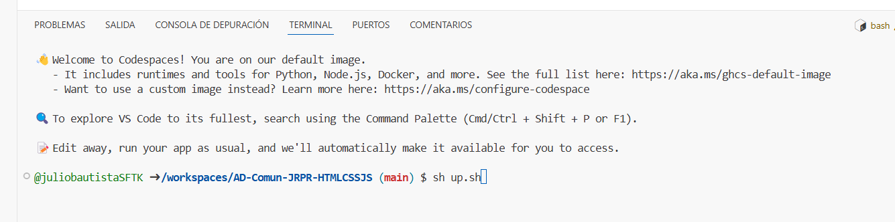
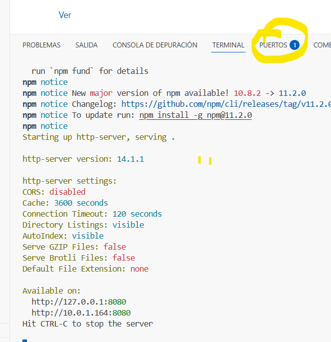
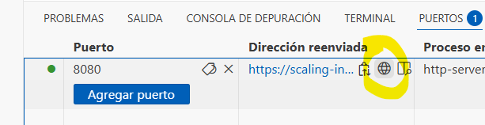
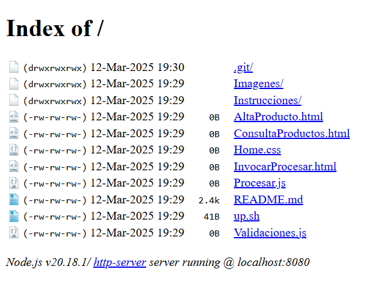

### Este codespace tiene un shell que levanta un servidor para ver los resultados

1.-Una vez abierto el codespaces, teclea sh up.sh y da enter.

Deberías ver una imagen como la siguiente:

 

2.-Una vez terminado el shell debe aparecer un puerto activo.

 

3.-Al seleccionar la pestaña aparece un renglón y al acercar el puntero aparece un símbolo de internet, da clic.

 

4.-Finalmente podrás seleccionar el archivo que deseas visaulizar en el navegador.

 
