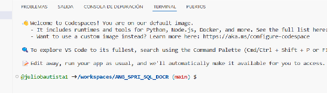

### Este codespace es un espacio para que entregues tu ejercicio

1.-Ejercicio 1 Polimorfismo.

Modelar en una herramienta CASE (no es código solo es modelado de clases) una jerarquía de figuras geométricas con una clase llamada FiguraGeometrica y un método llamado CalcularArea, debes permitir agregar nuevas figuras geométricas sin modificar las clases que ya tienes.

2.-Ejercicio 2 Inyección de dependencias.

Modelar en una herramienta CASE (no es código solo es modelado de clases) un servicio con inyección de dependencias el servicio procesara órdenes de compra y estas podrán pagarse con diferentes métodos de pago, sin modificar el código existente

Lee el documento Ejercicio_Comun_SWENG_TRJRPR que está en raíz en este repositorio, este ejercicio se basa en la sección "Temas: OOP Best Practices.".

3.-Para acceder a un Codespace selecciona Code una vez dentro de tu repositorio.

4.-Tendremos esta ventana con 2 pestañas.

5.-Selecciona Codespaces.

6.-Tendrás esta pantalla, en este ejemplo el Codespace se generará con las instrucciones en la rama main. 

Espera hasta que presente una pantalla similar a esta:

7.-Ya puedes utilizar este Codespace.
