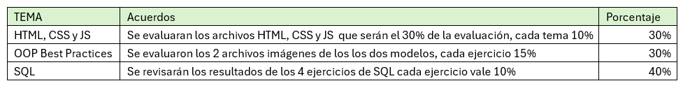

# **Instrucciones para el instructor**
[Ver](Instrucciones/Readme_instructor.md)

# **Instrucciones para el participante**
Lee el documento Ejercicio_Comun_SWENG_TRJRPR que está en raíz en este repositorio, este ejercicio se basa en la sección "Temas: OOP Best Practices.". Muy importante leas la siguiente sección.

[Da clic para acceder a este repositorio](Instrucciones/Readme_participante.md)

# **Ejercicio: Uso de OOP Best Practices (Aviso: Este ejercicio forma parte de 3 en total)**

Prerrequisito: Haber tomado los cursos internos de OOP Best Practices.

# **Objetivos:**
Leer y seguir los pasos del documento Ejercicio_Comun_SWENG_TRJRPR y completar las tareas descritas correspondientes a la sección "Temas: OOP Best Practices."

# **Cómo evaluar:**
Este ejercicio forma parte de 3 en total, la siguiente tabla muestra cómo se tomarán las entregas para la calificación.
 

# Evitar el plagio
Es de vital importancia no copiar la solución de otro colaborador, esto generará una práctica desleal y se levantará un Warning.

